# Legacy Modernization Agents to migrate COBOL to Java or C# developed with the Semantic Kernel Process Function

This open source migration framework was developed to demonstrate AI Agents capabilities for converting legacy code like COBOL to Java or C# .NET. Each Agent has a persona that can be edited depending on the desired outcome.
The migration is using Semantic Kernel Process Function where it does analysis of the COBOL code and it's dependencies. This information is then used to convert to either Java Quarkus or C# .NET (user's choice).

## Acknowledgements of collaboration
This project is a collaboration between Microsoft's Global Black Belt team and [Bankdata](https://www.bankdata.dk/). If you want to learn more about the collaboration and background of this project, have a look at [this](https://aka.ms/cobol-blog) and [this](https://www.bankdata.dk/about/news/microsoft-and-bankdata-launch-open-source-ai-framework-for-modernizing-legacy-systems) blog post.

## Call-to-Action
We are looking for real COBOL code to further improve this framework. If you want to actively collaborate, please reach out to us by opening an issue in this repository. - Gustav Kaleta & Julia Kordick

# Want to see the framework in action?
Have a look at the talk Julia did at the WeAreDevelopers World Congress 2025: https://www.youtube.com/watch?v=62OI_y-KRlw

## Table of Contents
- [Quick Start](#-quick-start) - Prerequisites, Dev Container, Neo4j, Demo
- [Features](#-features) - Core capabilities and functionality
- [Architecture](#-architecture) - Hybrid databases, system design, portal UI
- [CLI Reference](#-cli-commands-reference) - Doctor.sh and .NET commands
- [Step-by-Step Guide](#step-by-step-guide) - Configuration to deployment
- [How It Works](#how-it-works---architecture--flow) - Technical details
- [Azure Deployment](#️-azure-container-apps-deployment) - Deploy to Azure with azd
- [Known Issues & Ideas](#known-issues) - Troubleshooting and roadmap

## 🚀 Quick Start

### Prerequisites Checklist

- [ ] Docker Desktop installed and running
- [ ] .NET 9.0 SDK installed (`dotnet --version` shows 9.0.x) - [Download](https://dotnet.microsoft.com/download/dotnet/9.0)
- [ ] Azure OpenAI credentials ready (endpoint + API key) - GPT-5 and codex recommended
- [ ] 8GB RAM minimum, 16GB recommended
- [ ] Modern browser (Chrome, Edge, Firefox, Safari)

> **Note:** Hybrid database architecture: SQLite (metadata) + Neo4j (dependency graphs)

### ⚡ Fast Track Setup (Dev Container)

**Best for:** Team collaboration, consistent environment

```bash
# 1. Clone repository
git clone https://github.com/Azure-Samples/Legacy-Modernization-Agents.git
cd Legacy-Modernization-Agents

# 2. Open in VS Code
code .

# 3. When prompted, click "Reopen in Container"
# Wait 3-5 minutes for first-time setup

# 4. Configure Azure OpenAI (in container terminal)
cp Config/ai-config.local.env.example Config/ai-config.local.env
nano Config/ai-config.local.env
# Edit: AZURE_OPENAI_ENDPOINT, AZURE_OPENAI_API_KEY, AZURE_OPENAI_DEPLOYMENT_NAME

# 5. Run demo
./helper-scripts/demo.sh
# OR if in devcontainer, simply use:
demo
```

✅ **Done!** Portal opens at http://localhost:5028


**Fully automated environment** with .NET 9, Java 17, Neo4j, SQLite, Azure CLI, and pre-configured VS Code extensions.

**Included:** C# Dev Kit, Java Pack, Quarkus, Semantic Kernel, Neo4j, SQLite extensions  
**Aliases:** `demo`, `migration-run`, `portal-start`, `neo4j-status`

---

### 🔧 Manual Setup (Local Development)

**Best for:** Experienced developers, custom configurations

#### Step 1: Install Prerequisites

```bash
# Check .NET version
dotnet --version
# Should show: 9.0.x

# If not, install from: https://dotnet.microsoft.com/download/dotnet/9.0

# Check Docker
docker --version
docker ps
```

#### Step 2: Start Neo4j

```bash
# Option A: Docker Compose (recommended)
docker-compose up -d neo4j

# Option B: Manual Docker
docker run -d \
  --name cobol-migration-neo4j \
  -p 7474:7474 -p 7687:7687 \
  -e NEO4J_AUTH=neo4j/cobol-migration-2025 \
  neo4j:5.15.0

# Verify
docker ps | grep neo4j
# Wait 30 seconds for Neo4j to be ready
```

#### Step 3: Configure Azure OpenAI

```bash
# Copy template
cp Config/ai-config.local.env.example Config/ai-config.local.env

# Edit with your credentials
nano Config/ai-config.local.env
```

**Required values:**
```bash
AZURE_OPENAI_ENDPOINT="https://YOUR-RESOURCE.openai.azure.com/"
AZURE_OPENAI_API_KEY="your-32-character-key-here"
AZURE_OPENAI_DEPLOYMENT_NAME="gpt-5-mini-2"
```

**Find your values:**
- Endpoint: Azure Portal → OpenAI Resource → Keys and Endpoint → Endpoint
- API Key: Azure Portal → OpenAI Resource → Keys and Endpoint → Key 1
- Deployment: Your deployment name (e.g., "gpt-5-mini-2" or "gpt-4o")

#### Step 4: Build Project

```bash
# Restore dependencies
dotnet restore

# Build solution
dotnet build

# Verify zero warnings
# Output should show: "0 Warning(s), 0 Error(s)"
```

#### Step 5: Run Demo

```bash
# One command to start everything
./helper-scripts/demo.sh
# OR if in devcontainer:
demo

# Or manual steps:
# 1. Ensure Neo4j is running
# 2. cd McpChatWeb
# 3. dotnet run
# 4. Open http://localhost:5028
```

---

### 🎬 First Run Experience

After running `./helper-scripts/demo.sh`, you'll see:

```
╔══════════════════════════════════════════════════════════════╗
║   COBOL Migration Portal - Demo Mode                        ║
╚══════════════════════════════════════════════════════════════╝

🔍 Checking prerequisites...
✅ Docker installed
✅ .NET 9.0 SDK found
✅ Neo4j accessible

📊 Starting Neo4j...
✅ Neo4j is running

💾 Checking database...
✅ Database found with Run 43

🚀 Starting web portal...
⏳ Waiting for portal to start ✅

🌐 Access your demo:
   Portal:        http://localhost:5028
   Neo4j Browser: http://localhost:7474
```

### 🌐 Accessing the Portal

**In VS Code Dev Container:**
1. Look for the "PORTS" tab in the bottom panel (next to Terminal)
2. Find port `5028` in the list
3. Click the **globe icon (🌐)** to open in browser
4. Or run: `./helper-scripts/open-portal.sh`

**In Local Environment:**
- Browser will auto-open to http://localhost:5028
- Or manually visit: http://localhost:5028

### 📊 Portal Features
- Three-panel dashboard
- AI-powered chat with Azure OpenAI
- Interactive dependency graph
- Multi-run support
- Real-time file analysis

---

### 🧪 Test Your Setup

#### 1. Verify Portal Loads

**Expected:**
- ✅ Three panels visible (resources | chat | graph)
- ✅ Graph shows "Dependency Graph | Run 43"
- ✅ Resources list shows 8 MCP resources
- ✅ Suggestion chips visible in chat

**If not working:**
```bash
# Check portal logs
# Look for "Now listening on: http://localhost:5028"
```

#### 2. Test Chat

**Try this query:**
```
"Hello, what can you help me with?"
```

**Expected response:**
- ✅ AI responds with migration capabilities
- ✅ Response appears within 3-5 seconds
- ✅ No error messages

**If error:**
```bash
# Check Azure OpenAI config
./doctor.sh doctor
```

#### 3. Test File Analysis

**Try this query:**
```
"What functions are in BDSDA23.cbl?"
```

**Expected response:**
- ✅ Program purpose description
- ✅ List of functions/paragraphs
- ✅ Variables with PIC clauses
- ✅ Copybooks referenced
- ✅ Data source URI shown

#### 4. Test Multi-Run

**Try this query:**
```
"Show me run 42"
```

**Expected:**
- ✅ Response shows Run 42 data
- ✅ Graph updates automatically
- ✅ Graph header shows "Run 42"
- ✅ Response includes SQLite and Neo4j data

#### 5. Test Graph

**Actions:**
- Click **"Full Graph"** filter
- Zoom in with mouse wheel
- Click on a blue node (program)
- Click on a red node (copybook)
- Hover over edges (relationships)

**Expected:**
- ✅ Graph displays 49 nodes + 64 edges
- ✅ Smooth zooming and panning
- ✅ Tooltips appear on hover
- ✅ Node selection highlights

---

### 🎓 First Tasks to Try

#### Task 1: Explore Dependencies (2 minutes)

```
1. Click "🔄 Circular Dependencies" chip
2. Read AI response about cycles
3. Click "Programs Only" filter
4. Observe only blue nodes shown
5. Click "Full Graph" to restore
```

#### Task 2: Analyze a File (3 minutes)

```
1. Type: "What does RENI033.cpy contain?"
2. Read the analysis response
3. Note the variables and their PIC clauses
4. Click on the file node in graph
5. Explore relationships visually
```

#### Task 3: Compare Runs (3 minutes)

```
1. Type: "Show me run 43"
2. Note the statistics (102 files, etc.)
3. Type: "Now show me run 42"
4. Watch graph update automatically
5. Compare the two runs
```

#### Task 4: Access Raw Data (5 minutes)

```
1. Click "📖 Data Retrieval Guide"
2. Copy SQLite query example
3. Open terminal
4. Run: sqlite3 Data/migration.db
5. Paste query and explore
```

---

### ❓ Common Issues & Solutions

#### Issue: "NETSDK1045: The current .NET SDK does not support targeting .NET 9.0"

**Solution:**
```bash
# Install .NET 9.0 SDK
https://dotnet.microsoft.com/download/dotnet/9.0

# Verify
dotnet --version
# Should show: 9.0.x
```

#### Issue: "Neo4j connection refused"

**Solution:**
```bash
# Check if running
docker ps | grep neo4j

# If not running, start it
docker-compose up -d neo4j

# Wait 30 seconds, then verify
curl http://localhost:7474
```

#### Issue: "Azure OpenAI API error"

**Solution:**
```bash
# Check configuration
./doctor.sh doctor

# Verify endpoint ends with /
# Verify API key is 32 characters
# Verify deployment name matches your Azure OpenAI deployment (e.g., "gpt-5-mini-2")

# Test connection
./doctor.sh test
```

#### Issue: "Portal shows no data"

**Solution:**
```bash
# Check database exists
ls -lh Data/migration.db

# If missing, run a migration first
./doctor.sh run

# Or use demo mode (uses existing data)
./helper-scripts/demo.sh
# OR if in devcontainer:
demo
```

#### Issue: "Graph not displaying"

**Solution:**
1. Open browser DevTools (F12)
2. Check Console tab for JavaScript errors
3. Verify `/api/graph` endpoint returns data:
   ```bash
   curl http://localhost:5028/api/graph | jq '.nodes | length'
   # Should show: 49
   ```
4. Hard refresh browser (Ctrl+Shift+R or Cmd+Shift+R)

---

### 🎉 Success Criteria

You're all set when:

- ✅ Portal loads at http://localhost:5028
- ✅ Chat responds to queries
- ✅ Graph displays nodes and edges
- ✅ File analysis returns detailed data
- ✅ Multi-run queries work
- ✅ Zero build warnings
- ✅ Neo4j accessible at http://localhost:7474

**Time to start migrating COBOL! 🚀**

---

#### Screenshots


## ✨ Features

### 1. 🔄 Dual Language Support (Java & C#)

**Choose Your Target Language:**
- Interactive selection during migration: Java Quarkus or C# .NET
- Separate converter agents optimized for each language
- Unified `output/` folder for generated code
- Agent personas customized for Java/Quarkus or C#/.NET expertise

### 2. 🔍 Reverse Engineering

**Extract Business Logic Without Full Migration:**
- Standalone `reverse-engineer` command
- Generates human-readable documentation from COBOL
- Produces business features, user stories, and domain models
- Glossary support (`Data/glossary.json`) translates technical terms
- Output: Comprehensive markdown with business rules and architecture

### 3. 🗄️ Hybrid Database Architecture

**SQLite + Neo4j for Comprehensive Data Storage:**
- **SQLite**: Migration metadata, runs, file analysis, structured data
- **Neo4j**: Dependency graphs, relationships, visual analytics
- Real-time LOC calculation (excludes comments and blank lines)
- Multi-run queries: Switch context between historical migrations
- Full-text search capabilities

### 4. 📊 Enhanced Dependency Tracking

**Comprehensive COBOL Statement Detection:**
- **CALL** - Program invocations with line numbers
- **COPY** - Copybook inclusions
- **PERFORM** - Procedure calls and loops
- **EXEC SQL** - Embedded SQL statements
- **READ/WRITE** - File I/O operations
- **OPEN/CLOSE** - File handling

**Visual Differentiation:**
- Color-coded edges in dependency graph (CALL=green, COPY=blue, etc.)
- Edge labels show type and line numbers (e.g., "CALL (L42)")
- Tooltips display full context from source code
- Filterable by edge type with checkboxes

**Example:**
```cobol
Line 42: CALL 'FORMAT-BALANCE' USING WS-AMOUNT
```
Appears as: `CUSTOMER-DISPLAY.cbl → FORMAT-BALANCE.cbl [CALL (L42)]`

### 5. 💬 File Content Analysis

Ask natural language questions about COBOL file contents directly in the chat interface:

**Example Queries:**
```plaintext
"What functions are in BDSDA23.cbl?"
"What methods are used in RGNB649.cbl?"
"What does the copybook RENI033.cpy contain code wise?"
"Show me the variables in BDSIW13.cbl"
"What paragraphs are in AGSFZ01.cbl?"
```

**What You Get:**
- ✅ **Program Purpose**: High-level description of what the file does
- ✅ **All Functions/Paragraphs**: Complete list with descriptions and logic summaries
- ✅ **Variables**: Top 15 variables with PIC clauses, types, levels, usage
- ✅ **Copybooks Referenced**: All COPY statements and dependencies
- ✅ **Data Source**: MCP resource URI with API endpoint reference

**How It Works:**
1. Chat endpoint detects file-related queries using regex pattern
2. Queries MCP resource: `insights://runs/{runId}/analyses/{fileName}`
3. Parses `rawAnalysisData` JSON field for detailed structure
4. Extracts from nested arrays: `paragraphs-and-sections-summary`, `variables`, `copybooksReferenced`
5. Falls back to SQLite direct query if MCP unavailable

**Example Response:**
```markdown
📄 Analysis for BDSDA23.cbl (Run 43)

**Purpose:**
Batch data synchronization agent for daily transaction processing

**Functions/Paragraphs (23):**
- **`MAIN-PROCESS`**: Main entry point, orchestrates batch workflow
- **`VALIDATE-INPUT`**: Validates input file records for completeness
- **`PROCESS-TRANSACTIONS`**: Iterates through transactions and updates database
...

**Variables (15):**
- `WS-RECORD-COUNT` PIC 9(8) (numeric)
- `WS-TRANSACTION-DATE` PIC X(10) (alphanumeric)
- `WS-ERROR-FLAG` PIC X (boolean)
... and 8 more

**Copybooks Referenced (5):**
- RENI033.cpy
- BDSCOPY1.cpy
- COMMON.cpy

**Data Source:** MCP Resource URI: `insights://runs/43/analyses/BDSDA23.cbl`
**API:** `GET /api/file-analysis/BDSDA23.cbl?runId=43`
```

### 6. 🔄 Multi-Run Query Support

Query any historical run: "Show me run 42". Automatically queries both SQLite and Neo4j, updates graph visualization, and labels data sources. Perfect for comparing different migration attempts or analyzing specific runs.

### 7. 📈 Dynamic Graph Updates

Graph auto-updates when querying different runs. Frontend detects `runId` in response and refreshes visualization without manual intervention. Interactive vis-network graph with zoom, pan, and filtering capabilities.

### 8. 📄 Migration Report Generation

**Generate Comprehensive Reports:**
- **Via Portal**: Click "📄 Generate Report" on any migration run
- **Via CLI**: Prompted after each `./doctor.sh run` completion
- **Via API**: `GET /api/runs/{runId}/report`

**Report Contents:**
- Migration summary (file counts, target language)
- Dependency breakdown by type (CALL, COPY, PERFORM, etc.)
- Complete file inventory with line counts
- Detailed dependency relationships table
- Line numbers and context for each dependency

**Report Formats:**
- View rendered in portal with Markdown formatting
- Download as `.md` file for documentation
- Auto-saved to `output/migration_report_run_{runId}.md`

**Example Report Structure:**
```markdown
# COBOL Migration Report - Run 6

## 📊 Migration Summary
- Total COBOL Files: 5
- Programs (.cbl): 3
- Copybooks (.cpy): 2
- Total Dependencies: 8
  - CALL: 2
  - COPY: 3
  - PERFORM: 2
  - READ: 1

## 📁 File Inventory
| File Name | Path | Lines |
|-----------|------|-------|
| CUSTOMER-INQUIRY.cbl | source/ | 156 |
...

## 🔗 Dependency Relationships
| Source | Target | Type | Line | Context |
|--------|--------|------|------|----------|
| CUSTOMER-INQUIRY.cbl | CUSTOMER-DISPLAY.cbl | CALL | 42 | CALL 'CUSTOMER-DISPLAY' |
...
```

### 9. 🎨 Mermaid Diagram Support

**Interactive Architecture Documentation:**
- All Mermaid flowcharts, sequence diagrams, and visualizations render automatically
- Dark theme matching portal design
- Zoomable and pan-able diagrams
- Syntax highlighting for code blocks
- Supported diagram types: Flowcharts, Sequence, Class, ER diagrams
- Integrated into "📄 Architecture Documentation" portal view

### 10. 🌐 Interactive Web Portal

**Comprehensive Dashboard at http://localhost:5028:**
- Three-panel layout: Resources | Chat | Graph Visualization
- AI-powered chat with MCP-backed responses
- Run selector dropdown with historical runs
- Dark theme with rich colors and modern UI
- Real-time updates and interactive controls
- Example queries section for quick analysis
- Data retrieval guide modal

### 11. 🔌 MCP (Model Context Protocol) Integration

**9 MCP Resources per Migration Run:**
- Run summary, file lists, dependency graphs
- Circular dependency analysis, critical files
- Individual COBOL and generated code files
- Per-file dependencies and detailed analyses
- REST API endpoints for programmatic access

### 12. 🚀 DevContainer Auto-Start

**Fully Automated Development Environment:**
- Services launch automatically on container restart
- Portal auto-starts at http://localhost:5028
- Neo4j with health checks and auto-recovery
- Pre-configured VS Code extensions
- Bash aliases for common commands
- Locked ports prevent configuration drift

---

## 🏗️ Architecture

**Supported Diagram Types:**
- Flowcharts (system architecture)
- Sequence diagrams (process flows)
- Class diagrams (data models)
- ER diagrams (database schemas)

**Example:**
Markdown with `mermaid` code blocks automatically renders as interactive SVG diagrams in the browser.

**Technologies:**
- **Mermaid.js 10.x** - Diagram rendering engine
- **Marked.js 11.x** - Markdown parser
- Dark theme with custom color scheme matching portal

---

### 4. 📚 Data Retrieval Guide

Access comprehensive data access documentation directly in the portal via the **"📖 Data Retrieval Guide"** button.

**What's Included:**
- 🗄️ **SQLite Instructions**: 
  - Database location and schema
  - 5 example queries (runs, files, analyses, Java code, dependencies)
  - Tool recommendations (sqlite3 CLI, DB Browser, VS Code extension)
  
- 🔗 **Neo4j Instructions**:
  - Connection details (bolt://localhost:7687)
  - Credentials (neo4j / cobol-migration-2025)
  - 5 Cypher queries (runs, files, dependencies, circular deps, critical files)
  - Tool recommendations (Neo4j Browser, Desktop, cypher-shell)

- 🎯 **MCP API Instructions**:
  - All available MCP resource URIs
  - REST API endpoints (/api/resources, /api/chat, /api/graph)
  - Example API calls with curl commands

- 📋 **Copy-Paste Examples**:
  - Three complete workflows (SQLite, Neo4j, API)
  - Step-by-step commands ready to use
  - No configuration needed

**API Endpoint:**
```bash
GET /api/data-retrieval-guide
```

**Modal Features:**
- Dark theme matching portal design
- Syntax highlighting for code blocks
- Organized in collapsible sections
- Close with X button or click outside

---

## �🏗️ Complete Architecture

### 🗄️ Hybrid Database Architecture

This project uses a **dual-database approach** for optimal performance and functionality:

```mermaid
flowchart TB
    subgraph INPUT["📁 Input Layer"]
        COBOL["COBOL Source Files<br/>(.cbl, .cpy)"]
    end
    
    subgraph PROCESS["🔄 Migration Process"]
        ANALYZER["🔍 CobolAnalyzerAgent<br/>Structure Analysis"]
        CONVERTER["☕/C# CodeConverterAgent<br/>Java Quarkus or C# .NET Translation<br/>(User's Choice)"]
        MAPPER["🗺️ DependencyMapperAgent<br/>Relationship Analysis"]
    end
    
    subgraph STORAGE["💾 Hybrid Storage Layer"]
        SQLITE[("📊 SQLite Database<br/>Data/migration.db<br/><br/>• Run metadata<br/>• File content<br/>• AI analyses<br/>• Java/C# code<br/>• Metrics")]
        NEO4J[("🔗 Neo4j Graph DB<br/>bolt://localhost:7687<br/><br/>• Dependencies<br/>• Relationships<br/>• Graph data<br/>• Visualizations")]
    end
    
    subgraph REPO["🔀 Repository Layer"]
        HYBRID["HybridMigrationRepository<br/>Coordinates both databases"]
    end
    
    subgraph ACCESS["🌐 Access Layer"]
        MCP["🎯 MCP Server<br/>JSON-RPC API"]
        PORTAL["🖥️ Web Portal<br/>localhost:5250"]
        BROWSER["🔍 Neo4j Browser<br/>localhost:7474"]
    end
    
    subgraph OUTPUT["📦 Output"]
        JAVA["☕ Java Quarkus Code<br/>OR<br/>C# .NET Code"]
        REPORTS["📊 Reports & Logs"]
    end
    
    COBOL --> PROCESS
    PROCESS --> ANALYZER
    PROCESS --> CONVERTER
    PROCESS --> MAPPER
    
    ANALYZER --> HYBRID
    CONVERTER --> HYBRID
    MAPPER --> HYBRID
    
    HYBRID --> SQLITE
    HYBRID --> NEO4J
    
    SQLITE --> MCP
    NEO4J --> MCP
    NEO4J --> BROWSER
    
    MCP --> PORTAL
    
    PROCESS --> JAVA
    PROCESS --> REPORTS
    
    classDef inputStyle fill:#e3f2fd,stroke:#1976d2,stroke-width:3px,color:#000
    classDef processStyle fill:#f1f8e9,stroke:#689f38,stroke-width:3px,color:#000
    classDef storageStyle fill:#fff3e0,stroke:#f57c00,stroke-width:3px,color:#000
    classDef accessStyle fill:#f3e5f5,stroke:#7b1fa2,stroke-width:3px,color:#000
    classDef outputStyle fill:#e8f5e9,stroke:#388e3c,stroke-width:3px,color:#000
    
    class COBOL inputStyle
    class ANALYZER,CONVERTER,MAPPER processStyle
    class SQLITE,NEO4J,HYBRID storageStyle
    class MCP,PORTAL,BROWSER accessStyle
    class JAVA,REPORTS outputStyle
```



#### 📊 SQLite Database Stores:
- ✅ **Migration run metadata** (ID, status, timestamps, statistics)
- ✅ **COBOL file content** (original source code)
- ✅ **AI-generated analyses** (structured insights)
- ✅ **Generated Java code** (converted output)
- ✅ **Historical data** (all previous runs)
- ✅ **Metrics and performance** (tokens, costs, timings)

**Location**: `Data/migration.db` (configurable via `MIGRATION_DB_PATH`)

#### 🔗 Neo4j Graph Database Stores:
- ✅ **File-to-file dependencies** (program → copybook)
- ✅ **Call relationships** (program → program)
- ✅ **Transitive dependencies** (indirect relationships)
- ✅ **Graph visualization data** (for UI rendering)
- ✅ **Impact analysis** (what files are affected by changes)

**Connection**: `bolt://localhost:7687` (configured in `appsettings.json`)

#### 🔀 Why Both Databases?

| Aspect | SQLite | Neo4j |
|--------|--------|-------|
| **Purpose** | Document storage | Relationship mapping |
| **Strength** | Fast queries, simple setup | Graph traversal, visualization |
| **Data Type** | Flat/relational data | Connected graph data |
| **Use Case** | "What's in this file?" | "What depends on this file?" |
| **Query Style** | SQL SELECT statements | Cypher graph queries |

**Together they provide**: Fast metadata access + Powerful relationship insights 🚀

### 🖼️ Three-Panel Portal UI

The web portal at `localhost:5250` features a modern three-panel layout:

```mermaid
graph TB
    subgraph PORTAL["🌐 Web Portal Layout (localhost:5250)"]
        direction LR
        subgraph LEFT["📋 Left Panel<br/>(300px)"]
            RESOURCES["MCP Resources<br/>• Migration Runs<br/>• COBOL Files<br/>• Dependencies<br/>• Java Files<br/>• Graph Queries"]
        end
        
        subgraph CENTER["💬 Center Panel<br/>(Flexible)"]
            CHAT["Chat Interface<br/>• Ask questions<br/>• AI responses<br/>• Conversation history"]
            CHIPS["6 Suggestion Chips<br/>• Circular Dependencies<br/>• Critical Files<br/>• Impact Analysis<br/>• File Relationships<br/>• Dependency Summary<br/>• Conversion Stats"]
        end
        
        subgraph RIGHT["📊 Right Panel<br/>(500px)"]
            GRAPH["Dependency Graph<br/>• Interactive visualization<br/>• Zoom & pan<br/>• Click for details<br/>• Query filters<br/>• Layout options"]
        end
    end
    
    LEFT -.-> CENTER
    CENTER -.-> RIGHT
    
    classDef leftStyle fill:#e3f2fd,stroke:#1976d2,stroke-width:2px,color:#000
    classDef centerStyle fill:#f1f8e9,stroke:#689f38,stroke-width:2px,color:#000
    classDef rightStyle fill:#fff3e0,stroke:#f57c00,stroke-width:2px,color:#000
    
    class LEFT,RESOURCES leftStyle
    class CENTER,CHAT,CHIPS centerStyle
    class RIGHT,GRAPH rightStyle
```



**Portal Features:** 
- ✅ Dark theme with modern UI
- ✅ Three-panel layout (resources/chat/graph)
- ✅ AI-powered chat interface
- ✅ Suggestion chips for common queries
- ✅ Interactive dependency graph (zoom/pan/filter)
- ✅ Multi-run queries and comparisons
- ✅ File content analysis with line counts
- ✅ Comprehensive data retrieval guide
- ✅ **NEW:** Enhanced dependency tracking (CALL, COPY, PERFORM, EXEC, READ, WRITE, OPEN, CLOSE)
- ✅ **NEW:** Migration report generation per run
- ✅ **NEW:** Mermaid diagram rendering in documentation
- ✅ **NEW:** Collapsible filter sections for cleaner UI
- ✅ **NEW:** Edge type filtering with color-coded visualization
- ✅ **NEW:** Line number context for all dependencies

### 🔄 Agent Flowchart


### 🔀 Agent Responsibilities & Interactions

#### Advanced Sequence Flow (Mermaid)

```mermaid
sequenceDiagram
  participant User as 🧑 User / doctor.sh
  participant CLI as CLI Runner
  participant RE as ReverseEngineeringProcess
  participant Analyzer as CobolAnalyzerAgent
  participant BizLogic as BusinessLogicExtractorAgent
  participant Migration as MigrationProcess
  participant DepMap as DependencyMapperAgent
  participant Converter as CodeConverterAgent (Java/C#)
  participant Repo as HybridMigrationRepository
  participant Portal as MCP Server & McpChatWeb

  User->>CLI: select target language, concurrency flags
  CLI->>RE: start reverse engineering
  RE->>Analyzer: analyze COBOL files (parallel up to max-parallel)
  Analyzer-->>RE: CobolAnalysis[]
  RE->>BizLogic: extract business logic summaries
  BizLogic-->>RE: BusinessLogic[]
  RE->>Repo: persist analyses + documentation
  RE-->>CLI: ReverseEngineeringResult
  CLI->>Migration: start migration run with latest analyses
  Migration->>Analyzer: reuse or refresh CobolAnalysis
  Migration->>DepMap: build dependency graph (CALL/COPY/...)
  DepMap-->>Migration: DependencyMap
  Migration->>Converter: convert to Java/C# (AI-limited concurrency)
  Converter-->>Migration: CodeFile artifacts
  Migration->>Repo: persist run metadata, graph edges, code files
  Repo-->>Portal: expose MCP resources + REST APIs
  Portal-->>User: portal UI (chat, graph, reports)
```



#### CobolAnalyzerAgent
- **Purpose:** Deep structural analysis of COBOL files (divisions, paragraphs, copybooks, metrics).
- **Inputs:** COBOL text from `FileHelper` or cached content.
- **Outputs:** `CobolAnalysis` objects consumed by:
  - `ReverseEngineeringProcess` (for documentation & glossary mapping)
  - `DependencyMapperAgent` (seed data for relationships)
  - `CodeConverterAgent` (guides translation prompts)
- **Interactions:**
  - Uses Azure OpenAI via Semantic Kernel with concurrency guard (e.g., 3 AI calls at a time).
  - Results persisted by `SqliteMigrationRepository`.

#### BusinessLogicExtractorAgent
- **Purpose:** Convert technical analyses into business language (use cases, user stories, glossary).
- **Inputs:** Output from `CobolAnalyzerAgent` + optional glossary.
- **Outputs:** `BusinessLogic` records and Markdown sections used in `reverse-engineering-details.md`.
- **Interactions:**
  - Runs in parallel with analyzer results.
  - Writes documentation via `FileHelper` and logs via `EnhancedLogger`.

#### DependencyMapperAgent
- **Purpose:** Identify CALL/COPY/PERFORM/IO relationships and build graph metadata.
- **Inputs:** COBOL files + analyses (line numbers, paragraphs).
- **Outputs:** `DependencyMap` with nodes/edges stored in both SQLite and Neo4j.
- **Interactions:**
  - Feeds the McpChatWeb graph panel and run-selector APIs.
  - Enables multi-run queries (e.g., "show me CALL tree for run 42").

#### CodeConverterAgent(s)
- **Variants:** `JavaConverterAgent` or `CSharpConverterAgent` (selected via `TargetLanguage`).
- **Purpose:** Generate target-language code from COBOL analyses and dependency context.
- **Inputs:**
  - `CobolAnalysis` per file
  - Target language settings (Quarkus vs. .NET)
  - Migration run metadata (for logging & metrics)
- **Outputs:** `CodeFile` records saved under `output/java-output/` or `output/dotnet-output/`.
- **Interactions:**
  - Concurrency guards (pipeline slots vs. AI calls) ensure Azure OpenAI limits respected.
  - Results pushed to portal via repositories for browsing/download.

### ⚡ Concurrency Notes
- **Pipeline concurrency (`--max-parallel`)** controls how many files/chunks run simultaneously (e.g., 8).
- **AI concurrency (`--max-ai-parallel`)** caps concurrent Azure OpenAI calls (e.g., 3) to avoid throttling.
- Both values can be surfaced via CLI flags or environment variables to let `doctor.sh` tune runtime.

### 🔄 End-to-End Data Flow
1. `doctor.sh run` → load configs → choose target language → optional reverse engineering skip.
2. `ReverseEngineeringProcess` → discover files → analyze → extract business logic → emit markdown/glossary.
3. `MigrationProcess` → analyze (reuse or fresh) → map dependencies → convert code → persist outputs.
4. `HybridMigrationRepository` coordinates writes to SQLite (structured data) and Neo4j (graph edges).
5. `McpServer` exposes data via MCP resources; `McpChatWeb` surfaces chat, graphs, reports.
6. Portal and MCP clients display progress, allow queries, and fetch generated artifacts.

### 🔐 Configure Azure OpenAI Credentials

The project requires Azure OpenAI for **two purposes**:

1. **Migration Agents** (CobolAnalyzer, JavaConverter, DependencyMapper) - For code analysis and conversion
2. **MCP Chat Server** - For natural language queries about migration data

**Both use the same Azure OpenAI configuration** from `Config/appsettings.json`.

The project uses a secure two-file configuration system:

1. **`Config/ai-config.env`** - Template with default values (✅ safe to commit)
2. **`Config/ai-config.local.env`** - Your actual credentials (❌ never commit)

**Setup your credentials:**

```bash
# 1. Copy the template to create your local config
cp Config/ai-config.local.env.example Config/ai-config.local.env

# 2. Edit your local config with real values
nano Config/ai-config.local.env
```

**In `Config/ai-config.local.env`, update these lines:**
```bash
# Replace with your actual Azure OpenAI endpoint
AZURE_OPENAI_ENDPOINT="https://YOUR-RESOURCE-NAME.openai.azure.com/"

# Replace with your actual API key  
AZURE_OPENAI_API_KEY="your-32-character-api-key-here"

# Update deployment name to match your Azure setup
# Mini is a cheaper version and typically faster when testing
AZURE_OPENAI_DEPLOYMENT_NAME="gpt-5-mini-2"
```

**🔍 How to find your Azure OpenAI values:**
- **Endpoint**: Azure Portal → Your OpenAI Resource → "Resource Management" → "Keys and Endpoint" → Endpoint
- **API Key**: Azure Portal → Your OpenAI Resource → "Resource Management" → "Keys and Endpoint" → Key 1
- **Deployment Name**: Azure AI Foundry → Your deployment name (e.g., "gpt-5-mini-2" or "gpt-4o")

**📋 Example `ai-config.local.env` with real values:**
```bash
# Example - replace with your actual values
AZURE_OPENAI_ENDPOINT="https://my-company-openai.openai.azure.com/"
AZURE_OPENAI_API_KEY="1234567890abcdef1234567890abcdef"
AZURE_OPENAI_DEPLOYMENT_NAME="gpt-5-mini-2"
AZURE_OPENAI_MODEL_ID="gpt-5-mini"
```

**⚠️ IMPORTANT**: 
- Make sure your endpoint ends with `/`
- API key should be 32 characters long
- Deployment name must match your Azure OpenAI deployment (e.g., "gpt-5-mini-2", "gpt-4o")

**Usage:** Same credentials power both migration agents and MCP chat server via `Config/appsettings.json`

### Neo4j Database

**Quick Start:**
```bash
# Auto-starts in dev container (recommended)
# OR manual start:
docker-compose up -d neo4j && docker ps | grep neo4j
```

**Connection Details:**
- **HTTP (Browser)**: http://localhost:7474
- **Bolt (Driver)**: bolt://localhost:7687
- **Username**: `neo4j`
- **Password**: `cobol-migration-2025`

---

## 🎯 CLI Reference

### Doctor.sh - Three Migration Modes

The `doctor.sh` script provides three distinct migration workflows:

#### 1️⃣ **Reverse Engineering Only** (No UI)
```bash
./doctor.sh reverse-eng
```
**What it does:**
- Extracts business logic, feature descriptions, and use cases from COBOL
- Generates `output/reverse-engineering-details.md` documentation
- **Does NOT** convert code to Java or C#
- **Does NOT** launch web UI
- Use when: You only need business documentation

#### 2️⃣ **Full Migration** (Reverse Eng + Conversion + UI + Report)
```bash
./doctor.sh run
```
**What it does:**
- First runs reverse engineering (or uses existing results)
- Then converts COBOL to Java Quarkus (or C# .NET - you choose)
- Generates all reports and documentation
- **Prompts to generate migration report** with comprehensive details
- **Launches web UI** at http://localhost:5028
- Use when: You want complete migration with business documentation

**New Features:**
- ✅ Target language selection (Java Quarkus or C# .NET)
- ✅ Optional report generation after migration
- ✅ Enhanced dependency tracking (CALL, COPY, PERFORM, EXEC, READ, WRITE, OPEN, CLOSE)
- ✅ Line-level context for all dependencies

#### 3️⃣ **Conversion Only** (Skip Reverse Eng, Launch UI)
```bash
./doctor.sh convert-only
```
**What it does:**
- Skips reverse engineering entirely
- Only performs COBOL to Java Quarkus or C# .NET conversion (you choose)
- Generates Java/C# code and migration reports
- **✅ Launches web UI** at http://localhost:5250
- Use when: You already have documentation or just need code conversion

### Other Doctor.sh Commands
```bash
./doctor.sh                    # Diagnose configuration
./doctor.sh setup              # Interactive setup wizard
./doctor.sh test               # System validation and health check
```

**Helper Scripts:**
```bash
./helper-scripts/demo.sh                    # Quick demo with sample COBOL files
./helper-scripts/verify-data-persistence.sh # Check database integrity
./helper-scripts/verify-port-standardization.sh # Verify ports 5028, 7474, 7687
```

### Direct .NET Commands
```bash
# Full migration with reverse engineering
dotnet run -- --source ./source

# Skip reverse engineering
dotnet run -- --source ./source --skip-reverse-engineering

# Reverse engineering only
dotnet run reverse-engineer --source ./source

# MCP server standalone
dotnet run mcp [--run-id 42]

# Conversation log viewer
dotnet run conversation
```

**Options:** `--verbose`, `--config <path>`, `--run-id <number>`, `--session-id <id>`

## Step-by-Step Guide

1. **Configure:** `cp Config/ai-config.local.env.example Config/ai-config.local.env` → Add Azure OpenAI endpoint, API key, deployment name
2. **Add COBOL files:** Place your COBOL files in `./source/`
3. **Run:** `./doctor.sh run` - Analyzes, converts (choose Java or C#), launches portal at http://localhost:5028
4. **Choose target:** Select Java Quarkus or C# .NET when prompted
5. **Explore:** Use portal UI (chat, graph) or connect MCP clients (Claude, Cursor)
6. **Results:** Generated code in `output/`, documentation in `output/`, logs in `Logs/`

**Portal features:** Three-panel UI, AI chat, multi-run queries, interactive graph, file content analysis

**Env variables:** `MCP_AUTO_LAUNCH=0` (skip portal), `MIGRATION_DB_PATH` (custom DB location)

---

## 🧪 Testing & Validation

```bash
# Run integration tests
dotnet test McpChatWeb.Tests/McpChatWeb.Tests.csproj

# Validate configuration
./doctor.sh test

# Verify data persistence
./helper-scripts/verify-data-persistence.sh

# Check port standardization
./helper-scripts/verify-port-standardization.sh
```

---

## 📊 Real Migration Stats

- **102 COBOL files** processed → **99 Java Quarkus files** generated (97% success rate)
- **205 Azure OpenAI API calls**, ~1.2 hours total, $0.31 cost
- **Outputs**: Java/C# code in `output/`, docs in `output/`, logs in `Logs/`, metadata in `Data/migration.db`, graph in Neo4j

---

## ☁️ Azure Container Apps Deployment

Deploy this demo to Azure Container Apps with a single command using Azure Developer CLI (azd).

### Prerequisites

- Azure CLI installed (`az --version`)
- Azure Developer CLI installed (`azd version`) - [Install azd](https://learn.microsoft.com/azure/developer/azure-developer-cli/install-azd)
- Azure subscription with permissions to create resources
- `Config/ai-config.local.env` configured with your Azure OpenAI credentials

### Quick Deploy

```bash
# 1. Login to Azure (both azd and az CLI are required)
azd auth login
az account show >/dev/null 2>&1 || az login

# 2. Create a new environment
azd env new cobol-demo-prod

# 3. (Optional) Specify Azure subscription and location
azd env set AZURE_SUBSCRIPTION_ID "your-subscription-id"
azd env set AZURE_LOCATION "japaneast"

# 4. Deploy everything in one command!
azd up

```
> **Tip:** If missing Data/migration.db, run a migration first. Use `doctor.sh run`

That's it! The deployment automatically reads your Azure OpenAI settings from `Config/ai-config.local.env`.

### What Gets Deployed

| Resource | Description |
|----------|-------------|
| **Resource Group** | `rg-<env-name>` |
| **Container Apps Environment** | Managed environment for containers |
| **Container Registry** | Private registry for app images |
| **Container App (mcpchatweb)** | Web portal (externally accessible) |
| **Container App (neo4j)** | Graph database (internal only) |
| **Storage Account** | Azure Files for data persistence |
| **Log Analytics** | Centralized logging |

### Resource Group Naming

The resource group name is determined by the environment name you specify:

```
rg-${AZURE_ENV_NAME}
```

**Examples:**

| azd Environment Name | Resource Group Name |
|---------------------|---------------------|
| `cobol-demo-prod` | `rg-cobol-demo-prod` |

### Environment Variables Reference

Environment variables are automatically loaded from `Config/ai-config.local.env`. You can also override them with `azd env set`.

| Variable | Required | Description |
|----------|----------|-------------|
| `AZURE_OPENAI_ENDPOINT` | ✅ | Azure OpenAI endpoint URL |
| `AZURE_OPENAI_API_KEY` | ✅ | Azure OpenAI API key |
| `AZURE_OPENAI_DEPLOYMENT_NAME` | ✅ | Model deployment name |
| `AZURE_OPENAI_MODEL_ID` | ❌ | Model ID (default: from config) |
| `NEO4J_PASSWORD` | ❌ | Neo4j password (default: `cobol-migration-2025`) |

### After Deployment

```bash
# View deployed resources
azd show

# Get the Web Portal URL
azd env get-values | grep SERVICE_MCPCHATWEB_URI

# View logs
az containerapp logs show --name mcpchatweb --resource-group rg-<env-name>

# Tear down all resources
azd down

```

### Update Deployment

```bash
# Deploy code changes only
azd deploy

# Update infrastructure and code
azd up

```

---

## 🔧 Advanced Topics
- **Folder structure:** Input: `source/`, Output: `output/`
- **Token limits:** GPT-5 Mini supports 32K tokens - adjust per agent in `appsettings.json`  
- **Agent personas:** Modify prompts for different outcomes (DB2→PostgreSQL, other languages)
- **Legacy languages:** Framework adaptable to APL, PL/I - update agent prompts accordingly

**Known Issues:**
- Content filtering may block Azure OpenAI calls
- Token limits: Don't exceed MaxTokens settings (32K for GPT-5 Mini)
- Model deployment names must match Azure configuration

**Extension Ideas:**
- Enhance agent prompts for specific migration scenarios
- Add support for additional legacy languages (PL/I, RPG, APL)
- Integrate with CI/CD pipelines  
- Improve test generation capabilities
- Contributions welcome!

---

## Disclaimer

This software is provided for **demonstration purposes only**. It is not intended to be relied upon for production use. The creators make no representations or warranties of any kind, express or implied, about the completeness, accuracy, reliability, suitability or availability. Any reliance on this software is strictly at your own risk.

## License

MIT License - Copyright (c) Microsoft Corporation. See full license terms in the repository.

---

## 📝 Known TODOs

### Project Naming Cleanup
- [ ] **Rename project from "CobolToQuarkusMigration" to "LegacyModernizationAgents"**
  - Update `CobolToQuarkusMigration.csproj` → `LegacyModernizationAgents.csproj`
  - Update references in `Legacy-Modernization-Agents.sln`
  - Update `doctor.sh` script references
  - Update namespace declarations in C# files
  - Update documentation references
  - Update Docker and build configuration files
  - Rationale: Project now supports multiple target languages (Java Quarkus and C# .NET), making the original name too specific

### Code Refactoring
- [ ] **Refactor parameter names in `MigrationProcess.cs`**
  - Rename `javaOutputFolder` → `outputFolder`
  - Rename `cobolSourceFolder` → `sourceFolder`
  - Rationale: Current names are language-specific but the framework supports multiple target languages (Java and C#)

````
