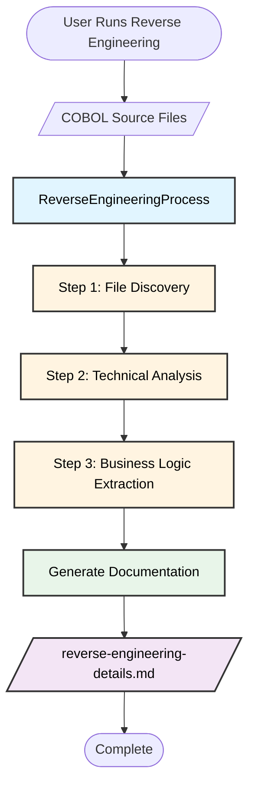
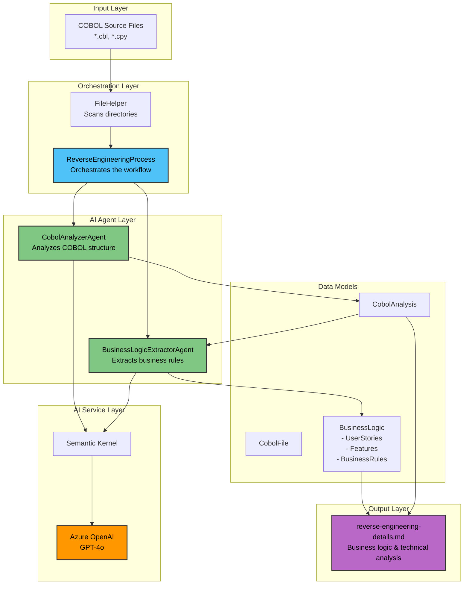
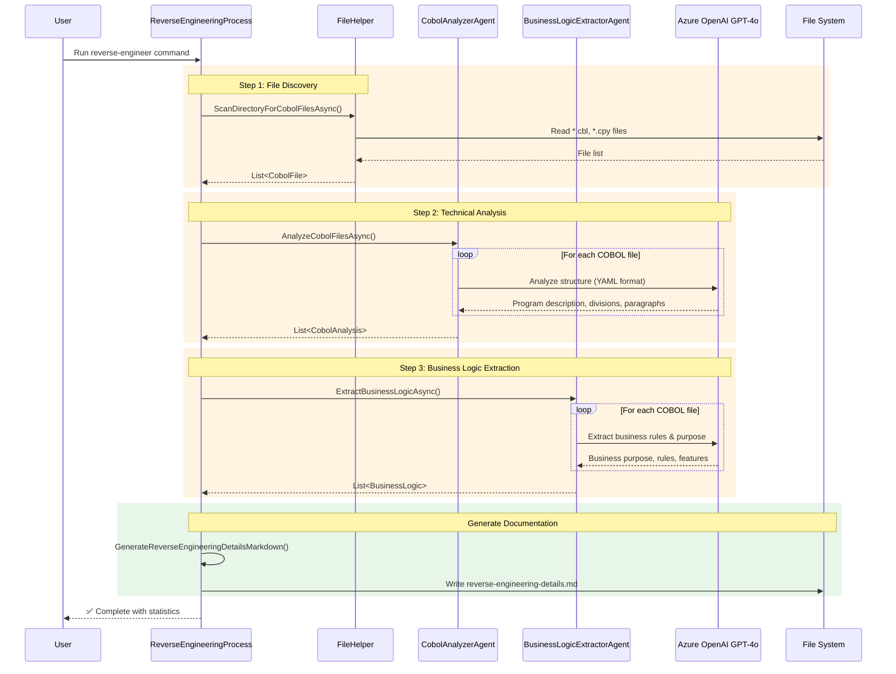
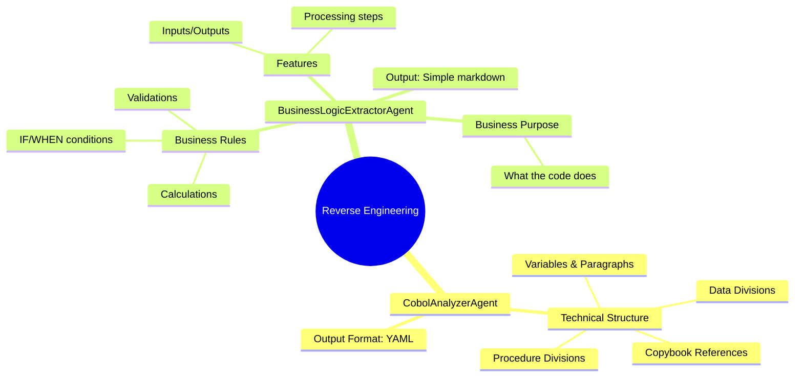
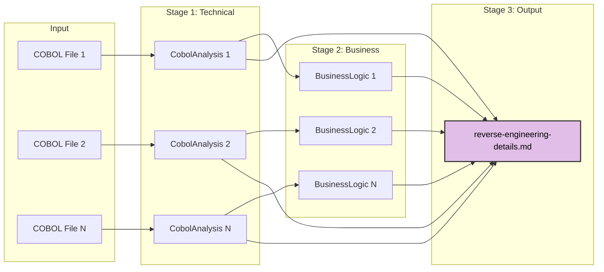
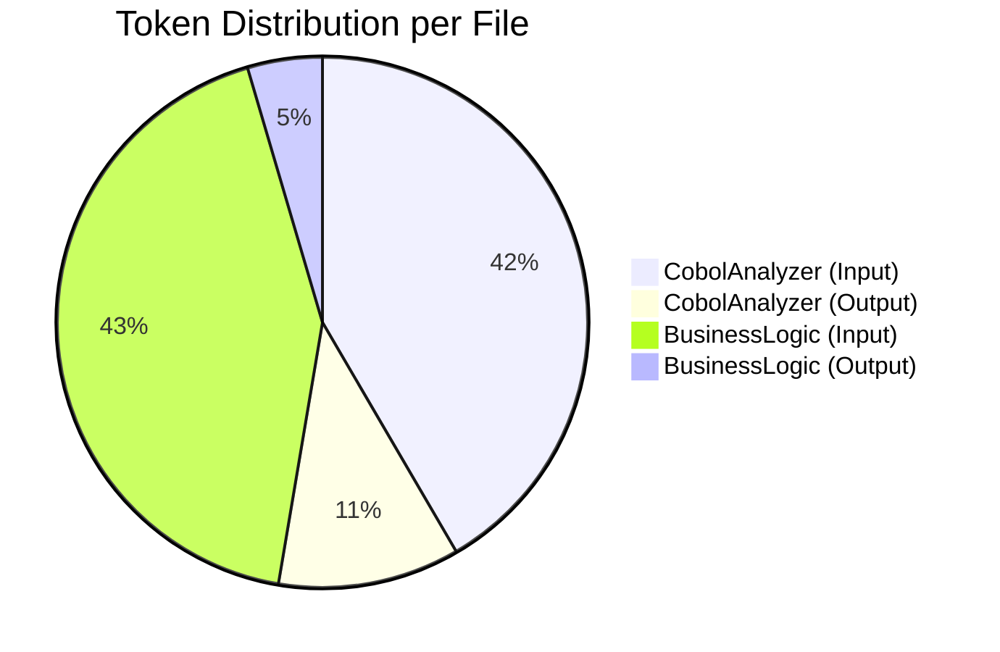

# Reverse Engineering Process Architecture

## High-Level Flow

## Detailed Architecture

## Step-by-Step Process Flow

## Agent Responsibilities

## Data Flow

## Key Design Decisions

### 1. **Sequential Processing**
- Each agent processes files one at a time
- Allows for progress tracking and error handling per file
- Could be parallelized in future for performance

### 2. **Simplified Prompts**
- Direct, actionable instructions to AI
- Removed complex classification systems
- Focus on extraction over categorization

### 3. **Unified Output**
- Single markdown file: `reverse-engineering-details.md`
- Combines business logic and technical analysis
- Focus on actionable documentation

### 4. **Agent Specialization**
- **CobolAnalyzerAgent**: Technical structure (what's in the code)
- **BusinessLogicExtractorAgent**: Business intent (what it means)

### 5. **Model Simplification**
- Removed unused fields and classes
- Cleaner data structures matching actual usage
- Focused on business logic extraction

## Performance Characteristics

For a single COBOL file (~1000 lines):
- **Step 1 (File Discovery)**: < 1 second
- **Step 2 (Technical Analysis)**: ~30 seconds, ~3000 tokens
- **Step 3 (Business Logic)**: ~10 seconds, ~1300 tokens
- **Documentation Generation**: < 1 second

**Total**: ~40 seconds per file

## Token Usage Pattern

## Future Enhancements

1. **Parallel Processing**: Process multiple files concurrently
2. **Incremental Analysis**: Cache results, only re-analyze changed files
3. **Domain Glossary**: Add business term definitions to improve accuracy
4. **Pattern Library**: Build reusable patterns from successful analyses
5. **Quality Metrics**: Score completeness and confidence of extractions
